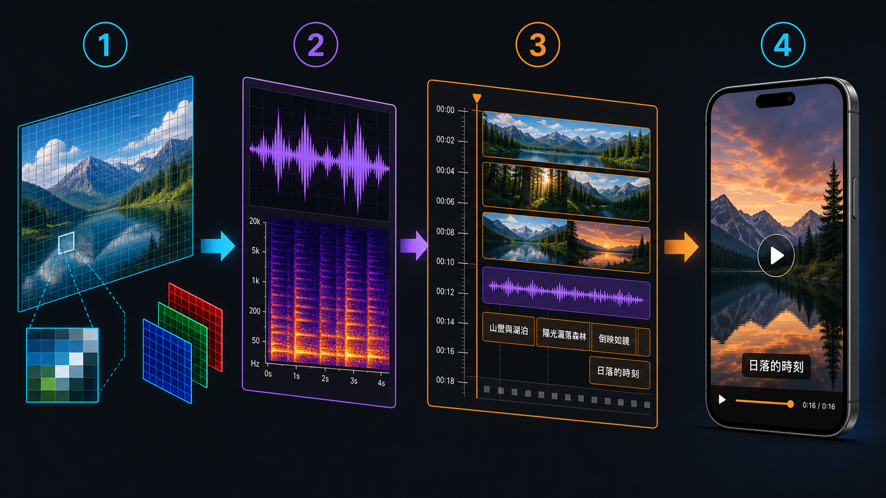
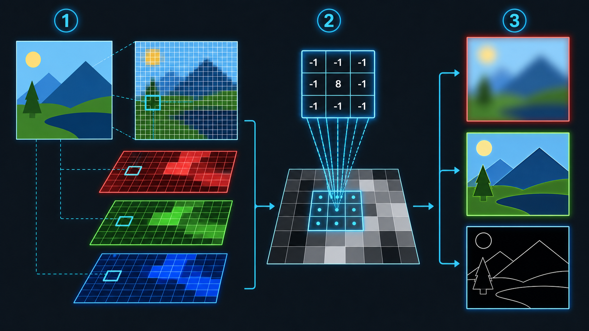
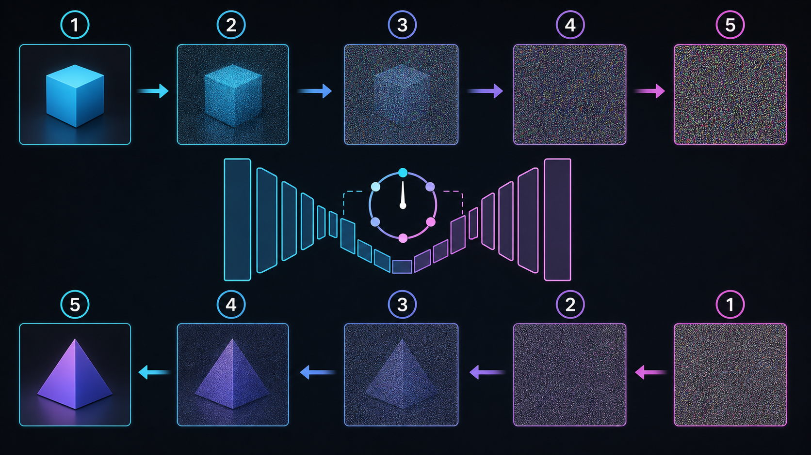
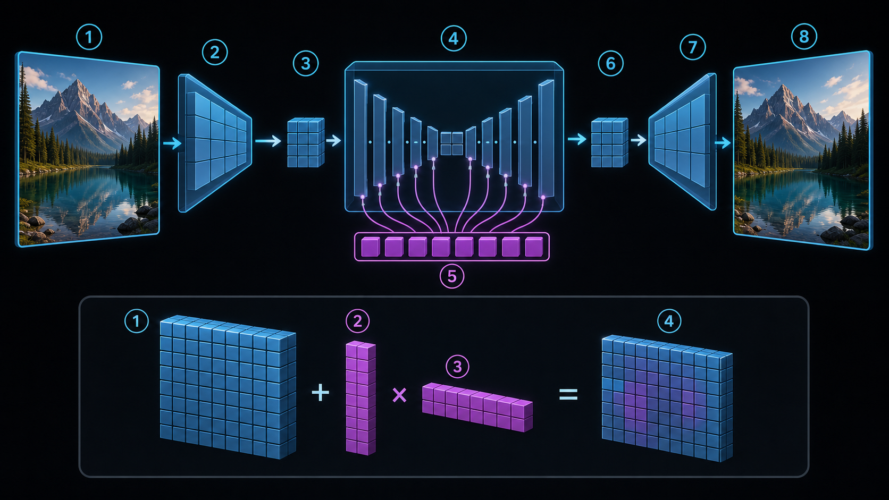
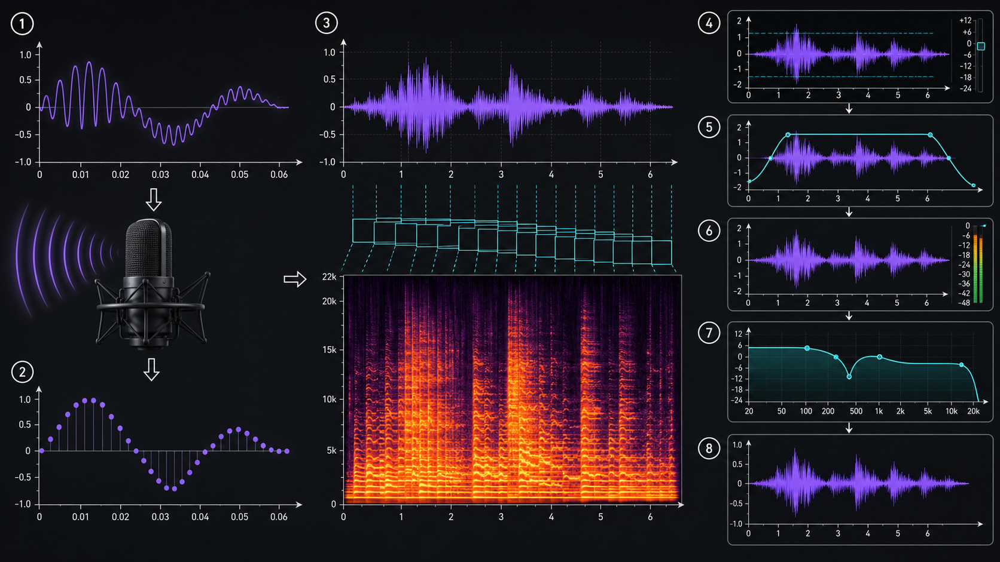
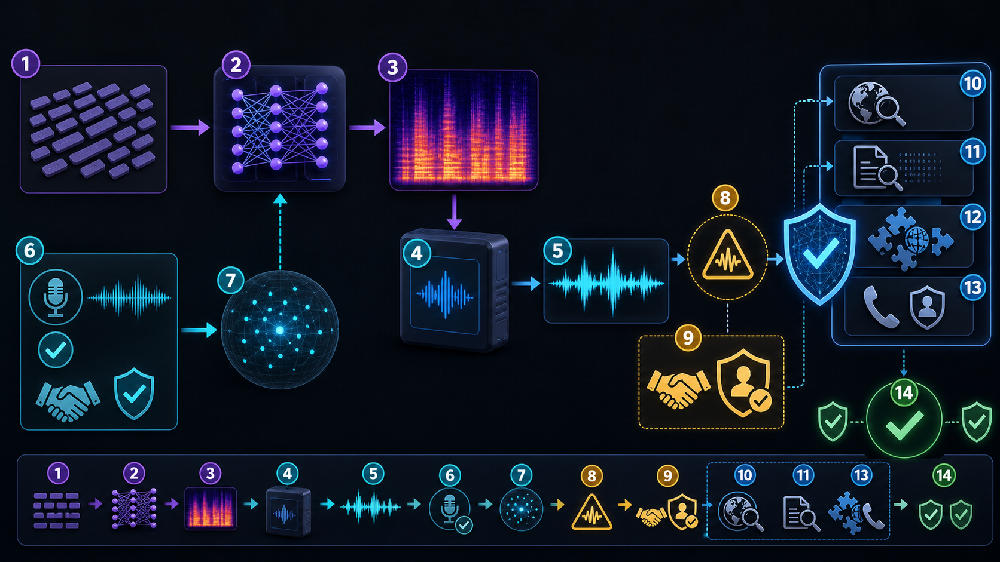
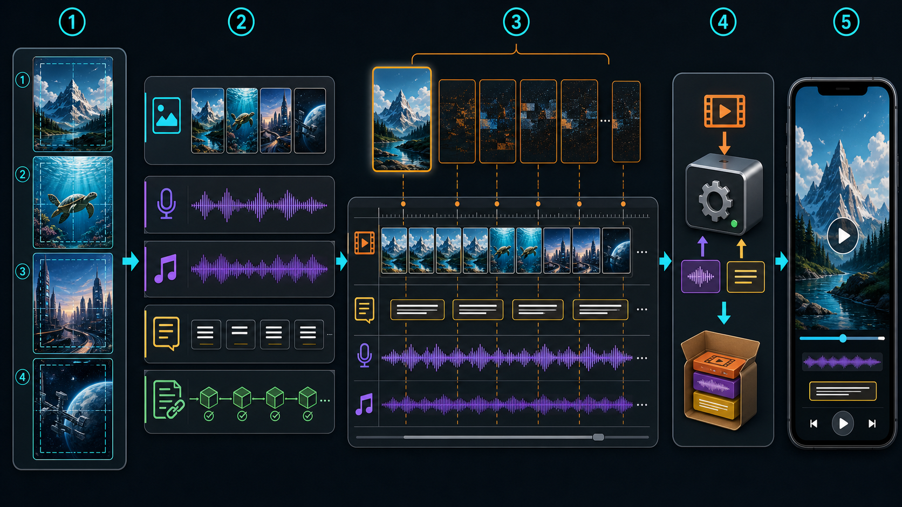

# 多媒體系統 V2：從影像、聲音到短影音

這本書把多媒體視為一條可以拆解、測試與重現的資料管線。影像、聲音與影片的資料結構不同，但都要回答同一組問題：輸入是什麼、如何表示、經過哪些處理、如何判斷品質，以及輸出能否安全發布。

## 閱讀方式

全書分成四部。每章先說明概念，再連到 V2 教材包中的週講義、程式與 Notebook。第一次閱讀先完成「基礎練習」；準備專題時，再回來做「延伸挑戰」。

- 第一部：多媒體資料與影像基礎
- 第二部：生成影像與視覺敘事
- 第三部：數位聲音與語音
- 第四部：短影音與系統整合

完整主題與週次關係見 [現行課程主題](../CURRENT_COURSE_TOPICS.md)，指定用書的重排方式見 [指定用書整合表](../TEXTBOOK_INTEGRATION_MAP.md)。

---

# 第一部｜多媒體資料與影像基礎

## 第 1 章｜多媒體系統不是檔案集合

多媒體作品通常同時包含影像、聲音、文字與影片。把素材放在同一個資料夾，還不能稱為系統。系統至少要交代六件事：

1. 輸入從哪裡來，格式與使用權利是什麼。
2. 資料如何被讀取與檢查。
3. 處理步驟與參數如何排列。
4. 中間結果如何保存與命名。
5. 輸出如何驗證品質與限制。
6. 別人能否依文件重新執行。

可以把基本管線寫成：

```text
輸入 → 檢查 → 轉換／生成 → 組合 → 驗證 → 輸出與紀錄
```



同一份素材可能在不同階段扮演不同角色。例如，一張 PNG 可以是生成模型的參考圖、短影音中的畫面，也可以是系統測試時的固定輸入。清楚命名輸入、中間檔與輸出，比累積大量未整理素材更重要。

### 可重現紀錄

每次實驗至少保留：

- 執行環境與套件版本。
- 輸入檔名、來源與授權。
- 關鍵參數與隨機種子。
- 輸出檔名與比較方式。
- 失敗案例、錯誤訊息與修正方法。
- AI 協作時的提示、採用內容與驗證方式。

### 對應材料

- [W01｜多媒體系統與 Markdown](../weeks/W01_課程啟動與多媒體系統.md)
- [AI 使用紀錄模板](../templates/ai-usage.md)
- [素材紀錄表](../templates/ASSET_LOG.csv)

### 基礎練習

選一支 15～30 秒短影音，畫出「影像、聲音、文字、處理與輸出」的關係。不要只列軟體名稱，要指出每一步接收什麼資料、產生什麼資料。

## 第 2 章｜取樣、量化與媒體資料

真實世界中的光與聲音通常是連續訊號。電腦要先選取觀測位置或時間，再把每次觀測轉成有限精度的數值。前者是取樣，後者是量化。

影像在空間上取樣，形成寬 × 高的像素網格；聲音在時間上取樣，形成依序排列的振幅數值；影片則在時間上取樣畫面，每一格畫面內又包含空間取樣。

### 資料量的第一個估算

未壓縮影像的理論資料量可以粗估為：

```text
寬 × 高 × 通道數 × 每通道位元數 ÷ 8
```

例如，RGB 影像通常有三個色彩通道。RGBA 多了一個透明度通道。實際檔案大小還會受到檔案標頭、metadata 與壓縮方式影響，所以理論資料量不等於磁碟上的檔案大小。

聲音資料量可從取樣率、位元深度、聲道數與時間估算；影片則還要加入畫面更新率、編碼方式與位元率。這些公式的價值不在背誦，而在檢查結果是否合理。

### 混疊與解析度

取樣不足時，高頻變化可能被誤認成較低頻的圖樣。影像可能出現摩爾紋，聲音可能出現錯誤頻率。提高取樣率不是唯一解法；適當的前置濾波與符合需求的輸出尺寸同樣重要。

### 對應材料

- [W02｜數位影像與像素](../weeks/W02_數位影像與像素.md)
- [影像基礎 CPU 實驗](../labs/w02_image_basics.py)
- [影像基礎 Colab](../colab/W02_Image_Basics.ipynb)
- [Repo 數位影像教材](../../media/image/README.md)

### 基礎練習

讀取同一張圖片的寬、高、模式與檔案大小，另存成 PNG 與 JPEG。比較檔案大小與畫面差異，並說明「像素尺寸不變」為什麼不代表「檔案大小不變」。

## 第 3 章｜像素運算、卷積與頻域

影像可以視為矩陣。灰階影像是一個二維陣列；彩色影像通常多一個通道維度。做運算前要先確認資料型別與有效範圍。`uint8` 常用 0～255 表示亮度，超出範圍時可能截斷或溢位。

### 逐像素與鄰域運算

逐像素運算只看目前位置，例如調整亮度。鄰域運算會同時查看附近像素，卷積就是常見方法。二維卷積可以表示為：

$$
y(i,j)=\sum_m\sum_n x(i-m,j-n)k(m,n)
$$

其中 $x$ 是輸入影像，$k$ 是卷積核，$y$ 是輸出。模糊核會平均鄰域，銳化核會強調中心與周圍的差異，邊緣核則回應快速變化。



實作時還要決定邊界填補、輸出大小、通道處理及數值範圍。函式庫可以完成計算，但不能替代這些選擇。

### 空間域與頻域

空間域直接處理像素位置；頻域把影像拆成不同變化速度的成分。低頻通常對應緩慢變化，高頻常包含邊緣、細節與雜訊。傅立葉轉換提供另一種觀察方式，但「高頻等於雜訊」並不成立，因為重要輪廓也可能位於高頻。

### 對應材料

- [W03｜卷積與影像處理](../weeks/W03_卷積與影像處理.md)
- [卷積 CPU 實驗](../labs/w03_convolution.py)
- [卷積 Colab](../colab/W03_Convolution.ipynb)
- [OpenCV／MediaPipe 延伸教材](../../08.OpenCV-Mediapipe-DEMO/)

### 基礎練習

對同一張影像套用模糊、銳化與邊緣核。每次只改一個卷積核，保留輸出與觀察，說明哪些差異來自核權重、哪些可能來自邊界處理。

---

# 第二部｜生成影像與視覺敘事

## 第 4 章｜擴散模型如何學習去噪

擴散模型的訓練可以從「逐步破壞資料，再學習如何復原」理解。前向過程把雜訊逐步加入影像；模型在不同時間步估計雜訊或相關目標；生成時則從雜訊開始，反覆執行反向步驟。

常見的前向表示為：

$$
q(x_t\mid x_0)=\mathcal{N}(\sqrt{\bar{\alpha}_t}x_0,(1-\bar{\alpha}_t)I)
$$

$x_0$ 是原始資料，$x_t$ 是第 $t$ 步的帶噪資料，$\bar{\alpha}_t$ 控制保留多少原始訊號。這個式子用來描述加噪分布，不代表只靠公式就能完成高品質生成。



### 為什麼先做前向實驗

完整模型訓練需要較多算力，但前向加噪可以用 NumPy 在 CPU 執行。觀察不同時間步的影像，有助於理解時間步、雜訊排程與可辨識資訊之間的關係。

### 對應材料

- [W04｜擴散模型原理](../weeks/W04_擴散模型原理.md)
- [前向擴散 CPU 實驗](../labs/w04_diffusion_forward.py)
- [前向擴散 Colab](../colab/W04_Diffusion_Forward.ipynb)

### 基礎練習

固定原圖與隨機種子，只改變時間步或雜訊強度，排出一組漸進結果。指出從哪個階段開始，原圖的主要結構已難以辨識。

## 第 5 章｜潛在空間、提示控制與可重現比較

高解析度影像包含大量像素。潛在擴散先用編碼器把影像壓到較小的潛在表示，在潛在空間進行去噪，再由解碼器還原影像。這能降低運算量，但潛在表示不是一般圖片壓縮檔，也不能直接解讀為單一視覺概念。



文字條件通常先經過文字編碼器，再透過交叉注意力影響去噪過程。提示只是條件的一部分；模型版本、seed、步數、取樣器、尺寸與引導強度都會影響結果。

分類器自由引導常以條件與無條件預測的差值調整文字條件強度：

$$
\hat{\epsilon}=\epsilon_{uncond}+s(\epsilon_{cond}-\epsilon_{uncond})
$$

$s$ 較大時不保證品質一定較好。過高的引導可能犧牲自然度或造成視覺瑕疵。

### 公平比較

要判斷某個提示或參數是否有效，至少應固定其他主要條件。一次同時更換模型、seed、尺寸與提示，結果就難以解釋。

### 對應材料

- [W05｜潛在擴散與提示控制](../weeks/W05_潛在擴散與提示控制.md)
- [W07｜生成影像工作室](../weeks/W07_生成影像工作室.md)
- [AI 與 LLM 延伸教材](../../11.AI/)

### 基礎練習

設計一個四格比較，只改變一個變因。保留提示、seed、步數與輸出，寫下觀察與限制。若使用線上服務而無法固定完整參數，也要明確記錄這項限制。

## 第 6 章｜LoRA、資料品質與影像一致性

模型微調不是把參考圖放進提示。微調會根據資料更新模型參數或附加參數。LoRA 將權重更新近似為兩個較小矩陣的乘積：

$$
\Delta W=BA
$$

當秩 $r$ 遠小於原權重維度時，需要訓練與保存的參數較少。這降低了微調成本，但不會自動解決資料偏差、授權或過擬合。


### 資料卡應回答的問題

- 圖片從哪裡來，是否有使用權利？
- 主體、背景、角度與光線是否過度單一？
- 標註文字是否描述真正需要學習的特徵？
- 訓練與比較資料是否分開？
- 哪些輸出表示模型只記住訓練圖？

實際訓練不是理解 LoRA 的必要條件。設備有限時，可以先比較預先產生的結果，練習辨識資料與參數造成的差異。

### 從單張到影像系列

短影音需要一組能共同工作的影像。先建立角色、色彩、構圖、光線與畫面比例規格，再生成或處理素材。單張看起來漂亮，不代表放進時間軸後能形成一致敘事。

### 對應材料

- [W06｜LoRA 與影像微調](../weeks/W06_LoRA與影像微調.md)
- [W07｜生成影像工作室](../weeks/W07_生成影像工作室.md)
- [W08｜期中影像展與技術說明](../weeks/W08_期中影像展與技術答辯.md)

### 基礎練習

規劃一份微調資料卡，或使用既有模型完成 3～6 張影像故事組。作品說明至少包含控制變因、失敗案例、後製方式與素材來源。

---

# 第三部｜數位聲音與語音

## 第 7 章｜聲音的取樣、波形與頻譜

數位聲音是一串依時間排列的振幅數值。取樣率 $f_s$ 表示每秒記錄幾次，位元深度表示每次振幅可使用多少離散值。若要避免理想條件下的混疊，取樣率應高於訊號最高頻率的兩倍；實際系統還需要考慮濾波器與硬體限制。



波形適合觀察時間位置、振幅與靜音；FFT 適合觀察整段訊號包含哪些頻率；STFT 把聲音切成短窗，可以看見頻率如何隨時間變化。窗長較大通常提供較細的頻率解析度，但時間定位較粗；窗長較小則相反。

### 對應材料

- [W10｜數位聲音與頻譜](../weeks/W10_數位聲音與頻譜.md)
- [聲音頻譜 CPU 實驗](../labs/w10_audio_spectrum.py)
- [聲音頻譜 Colab](../colab/W10_Audio_Spectrum.ipynb)
- [Repo 數位音訊教材](../../media/audio/README.md)

### 基礎練習

產生或讀取兩段頻率不同的聲音，繪出波形與頻譜。改變取樣率或 STFT 參數，說明圖形差異，不要只貼出結果。

## 第 8 章｜聲音剪輯、語音合成與深偽風險

裁切、淡入淡出、正規化、濾波、變速與變調都會改變數位訊號。處理順序沒有通用答案，但應能說明每一步解決什麼問題。例如，先裁掉無用片段可減少後續運算；正規化前若存在尖峰，整段音量可能仍然偏小。


### 語音合成管線

常見文字轉語音系統先把文字轉成聲學表示，再由 vocoder 生成波形。梅爾頻譜是常見的中間表示；speaker embedding 可以提供說話者條件；voice conversion 則在保留部分語言內容的同時改變聲音特徵。不同系統的實作不同，不能把這些元件視為固定配方。



聽起來像某人，不等於可以證明是某人。辨識深偽時，單靠主觀聽感或單一偵測器都不夠。較可靠的做法是同時檢查來源、檔案紀錄、內容脈絡、可疑訊號與其他獨立證據。

### 安全界線

只使用自己的聲音、取得明確同意的素材或完全合成角色。不得仿冒未同意者，也不得把合成內容包裝成真實錄音。生成與後製過程要留下揭露紀錄。

### 對應材料

- [W11｜聲音剪輯與訊號處理](../weeks/W11_聲音剪輯與訊號處理.md)
- [W12｜語音合成與深偽辨識](../weeks/W12_語音合成與深偽辨識.md)
- [聲音剪輯 CPU 實驗](../labs/w11_audio_edit.py)
- [聲音剪輯 Colab](../colab/W11_Audio_Edit.ipynb)
- [媒體倫理教材](../../media/ethics/README.md)

### 基礎練習

對同一段聲音做裁切、淡入淡出與正規化，保留處理前後波形及聆聽紀錄。另選一段合成或真實聲音，將判斷依據分成「可觀察訊號」「來源證據」與「仍不確定」三類。

---

# 第四部｜短影音與系統整合

## 第 9 章｜影片的時間結構、編碼與容器

影片是依時間顯示的畫面序列，通常還包含聲音、字幕與 metadata。畫面更新率表示每秒顯示多少格；解析度描述每格畫面的像素尺寸；位元率表示每秒配置多少資料量。三者相關，但不是同一件事。

未壓縮影片的資料量非常大，因此實際影片會利用空間與時間上的相似性壓縮。I-frame 可獨立解碼，其他畫面可能參考前後影格。GOP 描述一組相關影格的安排方式。



容器負責包裝不同資料流，例如 MP4；編碼器決定影像或聲音如何壓縮，例如 H.264。副檔名只能提示容器，不能完整說明內部使用的編碼。

### 對應材料

- [W13｜短影音腳本與數位影片](../weeks/W13_短影音腳本與數位影片.md)
- [W15｜FFmpeg 與短影音合成](../weeks/W15_FFmpeg與短影音合成.md)
- [短影音合成 CPU 實驗](../labs/w15_make_short.py)
- [短影音合成 Colab](../colab/W15_Make_Short.ipynb)
- [Repo 數位視訊教材](../../media/video/README.md)

### 基礎練習

用 `ffprobe` 或同類工具讀取一支影片的容器、影像編碼、聲音編碼、解析度、畫面更新率、時間與位元率。轉出另一個版本，只改一個輸出參數並比較品質與檔案大小。

## 第 10 章｜從腳本、分鏡到素材包

15～30 秒的短影音仍需要明確結構。先決定觀眾要理解什麼，再把時間分配給開場、主要訊息與收束。每個鏡頭應記錄畫面、旁白、字幕、音效、時間與轉場，避免進入剪輯後才發現資訊超出時間。


### 素材包是輸入契約

素材包不只是檔案集合。每個素材至少要有：

- 唯一檔名與媒體類型。
- 來源、作者與取得日期。
- 授權或同意狀態。
- 是否由 AI 生成或修改。
- 生成工具、提示與主要參數。
- 預定用途與後製紀錄。


來源不明的素材不應進入最終時間軸。若授權需要標示姓名或連結，應在作品說明或片尾保留。

### 對應材料

- [W13｜短影音腳本](../weeks/W13_短影音腳本與數位影片.md)
- [W14｜生成內容與素材溯源](../weeks/W14_生成內容與素材溯源.md)
- [素材紀錄表](../templates/ASSET_LOG.csv)
- [同意紀錄模板](../templates/CONSENT_RECORD.md)

### 基礎練習

完成四格或六格分鏡，建立對應素材表。讓另一位同學只看分鏡與素材表，檢查是否能判斷每個鏡頭要使用哪些檔案。

## 第 11 章｜短影音合成、測試與錯誤處理

短影音合成把影像、影片、聲音與字幕放到共同時間軸。開始合成前，先統一畫面比例、解析度、畫面更新率、聲音取樣率與檔名。格式不一致時，錯誤常在輸出階段才出現。


### 三類測試

1. **正常路徑**：所有必要素材存在，能產生符合規格的成品。
2. **邊界條件**：極短素材、不同尺寸、空白字幕或接近上限的檔案仍能合理處理。
3. **錯誤路徑**：檔案遺失、格式不支援或參數錯誤時，系統提供可理解的訊息，而不是只留下失敗輸出。

測試不只看程式有沒有結束。還要檢查影像是否變形、字幕是否超出畫面、聲音是否削波、同步是否偏移、輸出是否能在常見播放器開啟。

### 對應材料

- [W15｜FFmpeg 與短影音合成](../weeks/W15_FFmpeg與短影音合成.md)
- [W16｜系統整合與測試](../weeks/W16_進度小報告與系統測試.md)
- [pytest 延伸教材](../../07.Pytest-DEMO/)

### 基礎練習

為作品列出一個正常案例、一個邊界案例與一個錯誤案例。每個案例都記錄輸入、預期結果、實際結果與修正狀態。

## 第 12 章｜技術說明、發布與封存

完整作品應讓觀眾看得懂，也要讓檢查者能追溯技術選擇。發表時不要只展示成品，還要說明問題、輸入、處理管線、關鍵參數、比較證據、失敗案例、授權與限制。

### 專題包最低內容

```text
project/
├─ README.md
├─ AI_USAGE.md
├─ assets/
├─ src/ 或 notebooks/
├─ outputs/
├─ tests/ 或 test-results/
└─ asset-log.csv
```

README 至少包含環境、安裝、執行方式、輸入、參數、輸出、限制與來源。程式無法公開時，也要保留足以重現流程的步驟與參數。

### 發布前檢查

- 影像、聲音與影片是否取得必要授權或同意。
- 是否含有可識別個資、位置或未同意者。
- 生成與合成內容是否清楚揭露。
- 音量、字幕、畫面比例與播放相容性是否通過檢查。
- 專題包能否在另一個環境依 README 重跑。

### 對應材料

- [W17｜成果發表 A](../weeks/W17_期末成果發表A.md)
- [W18｜成果發表 B 與封存](../weeks/W18_期末成果發表B與封存.md)
- [成果評量規準](../templates/FINAL_RUBRIC.md)
- [媒體倫理與發布](../../media/ethics/README.md)

### 基礎練習

把專題複製到新的資料夾或環境，只依 README 執行一次。記錄無法重現的步驟，補齊缺少的檔案、套件版本與參數。

---

# 附錄 A｜工具與用途

| 工具 | 適合處理的工作 |
|---|---|
| Pillow | 影像讀寫、尺寸、色彩與基本轉換 |
| NumPy | 陣列、卷積、取樣與數值實驗 |
| OpenCV | 影像與影片處理、濾鏡及視覺分析 |
| librosa | 聲音載入、頻譜、STFT 與音訊特徵 |
| MoviePy | 以 Python 組合畫面、聲音與字幕 |
| FFmpeg／ffprobe | 轉碼、封裝、媒體資訊與批次處理 |
| Jupyter／Colab | 保存程式、說明、參數、圖表與結果 |
| Git | 保存版本與比較修改，但不應提交金鑰或敏感素材 |

# 附錄 B｜實驗證據模板

```markdown
## 問題
我要比較什麼？

## 固定條件
輸入、環境、模型或工具版本、未改變的參數。

## 改變的變因
這次只改哪一項？

## 結果
輸出、數值、圖表或聆聽／觀看紀錄。

## 解釋
結果支持什麼判斷？還有哪些其他可能原因？

## 限制
哪些條件無法控制、哪些結果尚不能推論？

## 來源與 AI 協作
素材、引用、提示、採用內容與驗證方式。
```

# 附錄 C｜主要來源

本書的論文與官方文件集中整理於 [課程主要來源](../references.md)。模型服務、免費額度與軟體介面可能變動；使用前應回到官方文件確認。指定用書配套講義的接入位置與適用邊界，見 [指定用書整合表](../TEXTBOOK_INTEGRATION_MAP.md)。
